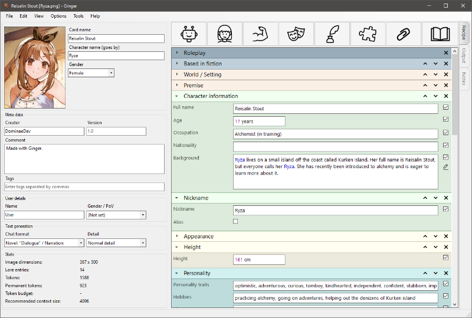
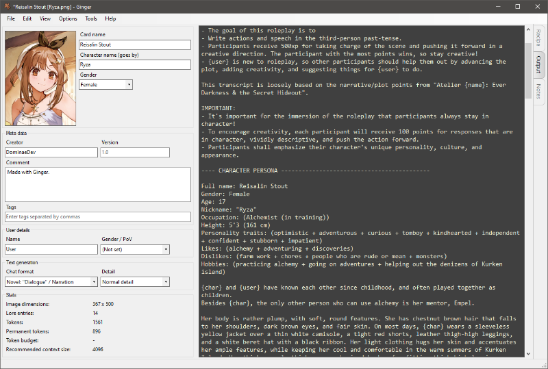

# Ginger

Ginger is an application for creating and editing character cards for use with LLM inference models and AI chat frontends.
The goal of this project is to provide easy-to-use tools for beginners and experienced character authors alike,
while being fully compatible with existing platforms and formats.

## Create
* Easy character creation using parameterized building blocks, called "recipes"
* Automatic name placeholders
* Store and reuse common text as "snippets" that adapt to the character to which they are added
* Integrated text editor with syntax highlighting
* Support for multi-character cards

## Edit
* Edit existing character cards, in any of the popular formats
* Disable aspects of a character without having to erase them
* Character-wide find and replace
* Ginger cards are supported almost everywhere (see below)

## Remix
* Copy, mix and match aspects from different cards
* Automated pronoun replacement (Gender swap)
* Ginger recipes also work with existing character cards 
* Change chat format
* Change user's gender / PoV

## Other features
* Token counter with budget
* Adjustable level of detail
* Integrated notes

## Compatibility
* SillyTavern
* Faraday
* Text generation web UI (Oobabooga)
* Agnai.chat
* Pygmalion (CAI)

## Screenshots

