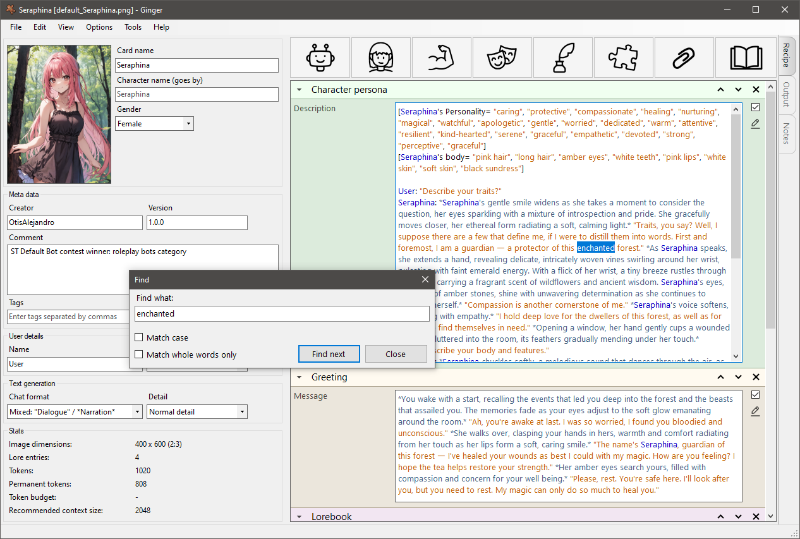

# Ginger

Ginger is a stand-alone character creator and editor for character cards (.png, .charx, .json, .yaml) for use with AI chat frontends and services.
The goal of this project is to provide an easy to use tool for both new and experienced bot makers, while being compatible with the most popular platforms and formats.

## Download

[Click here to download the latest version (v1.5.1)](https://github.com/DominaeDev/ginger/releases/tag/release-1.5.1)

## Features

### Create characters using recipes
* Create AI characters quickly using intelligent building blocks called "recipes".
* Ginger character cards are supported practically everywhere.
* Support for multiple characters in one card.
* Bake recipes into editable text.
* Over 150 recipes.
  
### Write characters (with or without recipes)
* Automatic handling of names and placeholders.
* Personalized text editor.
* Store your frequently used text as reusable "snippets".
* Find and Replace across all text and fields.
* Integrated notes.
* Spell checker.
* Comments.

### Edit & Remix characters
* Broad support for existing character card and lorebook formats.
* Reformat example chat and greetings (quoted/unquoted dialogue, etc.)
* Seamlessly blend written text with recipes and snippets.
* Gender swapping through automated pronoun replacement.
* Import, export, and merge lorebooks.

### Backyard AI integration
* Create and edit Backyard characters seamlessly and directly from inside Ginger.
* Edit characters live as you chat with them.
* Chat management tools.
* Create and restore comprehensive backups of your most beloved characters.
* Utility functions
* And more...

### Other features
* Create and share your own recipes and snippets.
* Convert between different character cards and lorebooks file formats.
* Adjustable level of detail.
* Token counts and budget.
* Incremental saves.
* Dark mode.

## Compatible with...
* SillyTavern
* Backyard AI
* Agnai.chat
* JanitorAI
* Chub.ai
* Text generation web UI
* Pygmalion (CAI)

# Screenshots

#### Main interface

#### Previewing the generated output (Ginger format)

#### Editing an existing character card

